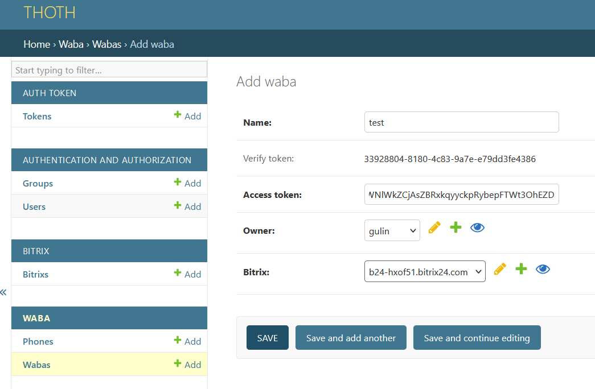

## Thoth: Bitrix24 Integration Hub 

### Описание

Одна инсталляция Thoth позволяет создавать и обслуживать неограниченное количество локальных приложений Битрикс24 с OAuth 2.0 авторизацией.

## Видеоинструкции на Youtube

https://www.youtube.com/playlist?list=PLeniNJl73vVmmsG1XzTlimbZJf969LIpS


## Установка 

Для тестового запуска использовался python 12

```
cd /opt
git clone https://github.com/vaestvita/thoth
cd thoth

python3 -m venv .venv
source .venv/bin/activate
pip install -r requirements.txt


cp env_example .env 
nano .env
заменить HOME_URL, ALLOWED_HOSTS, CSRF_TRUSTED_ORIGINS на свои значения
HOME_URL - домен по которму будет доступен thoth (example.com)

python manage.py migrate
python manage.py createsuperuser

python manage.py runserver 0.0.0.0:8000

```

После запуска сервера в файле .env будет создан ADMIN_URL, который необходимо исопльзовать для входя в админку

## Подключение портала Битрикс24

+ В админке создайте токен 


+ В Битрикс24 создайте серверное локальное приложение без интерфейса (Приложения – Разработчикам – Другое – Локальное приложение) в Битрикс24 и заполните соответствующие поля (Путь вашего обработчика и Путь для первоначальной установки) 
+ Необходимые права (Настройка прав): crm,imopenlines,contact_center,user,im,imconnector,disk
```
https://example.com/api/bitrix/?api-key=XXXXXXX
XXXXXXX - ваш токен 
```


+ В админке thoth перейдите в раздел Bitrix, там должен появиться ваш портал, откройте его и заполните значения полей Код приложения (client_id) и Ключ приложения (client_secret). Они были выданы Битриксом в предыдущем шаге при установке локального приложения


+ В битриксе в разделе "контакт-центр" должен появиться коннектор "THOTH WABA"


## Подключение WhatsApp (WABA)
+ Рекомендуется получить [Постоянный маркер](https://developers.facebook.com/docs/whatsapp/business-management-api/get-started), иначе придется перевыпускать токен каждый день
+ Создайте приложение на [портале разработчиков](https://developers.facebook.com/apps/)
+ В панели подключите продукты Webhooks, WhatsApp
+ В админке THOTH - WABA - Add waba 
+ + name - имя вашего приложения 
+ + Access token - Постоянный или временный маркер
+ + Bitrix - выберите портал к которму хотите привязать приложение WABA 
+ + Verify token - скопируйте 

+ На портале разработчиков - Quickstart > Configuration > 
+ + Callback URL - https://example.com/api/waba/?api-key=XXXXXXX
+ + Verify token - Verify token из предыдущего шага 

+ В админке thoth - waba - phones и добавляем номера (Phone - номер, Phone id - id из приложения фейсбук)
+ если все пройдет успешно, то в контакт центре коннектор станет зеленым и кнему будет прикрпелена линия THOTH_ваш_номер
