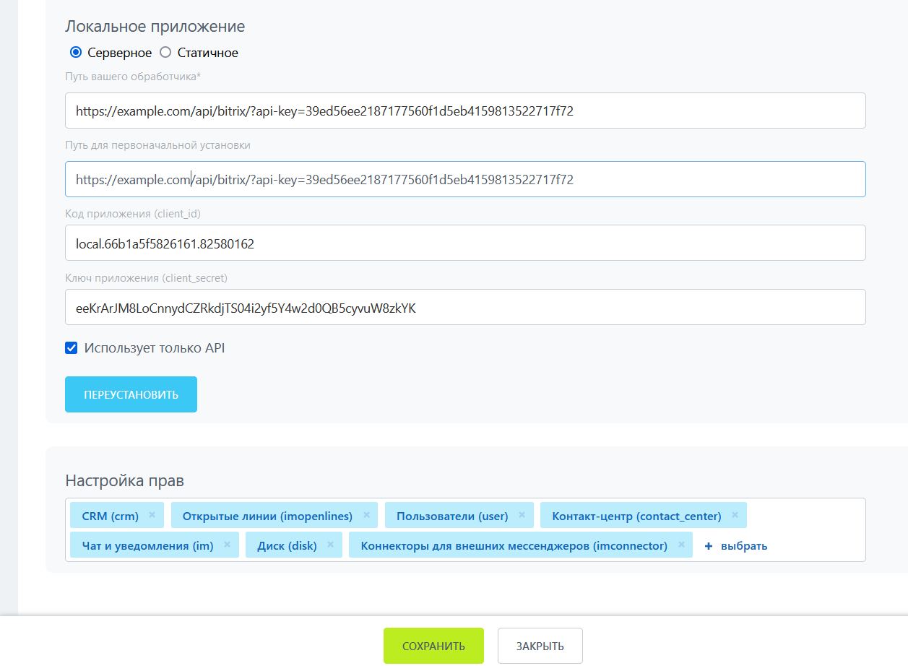
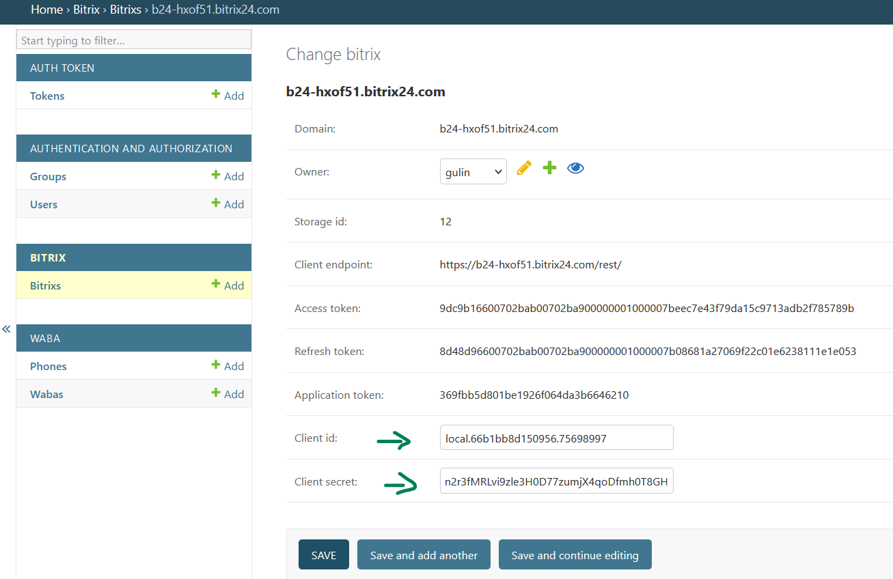
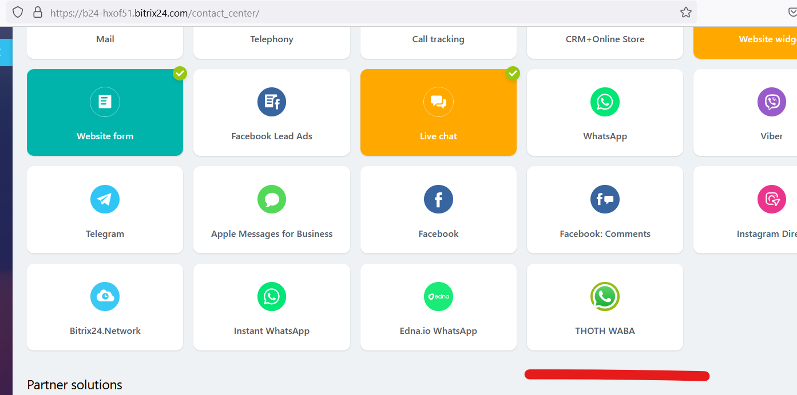

## Подключение портала Битрикс24

+ В админке создайте токен 


+ В Битрикс24 создайте серверное локальное приложение без интерфейса (Приложения – Разработчикам – Другое – Локальное приложение) в Битрикс24 и заполните соответствующие поля (Путь вашего обработчика и Путь для первоначальной установки) 
+ Необходимые права (Настройка прав): crm,imopenlines,contact_center,user,messageservice,im,imconnector,disk
```
https://example.com/api/bitrix/?api-key=XXXXXXX
XXXXXXX - ваш токен 
```



+ В админке thoth перейдите в раздел Bitrix, там должен появиться ваш портал, откройте его и заполните значения полей Код приложения (client_id) и Ключ приложения (client_secret). Они были выданы Битриксом в предыдущем шаге при установке локального приложения



+ В битриксе в разделе "контакт-центр" должен появиться коннектор "THOTH WABA"


