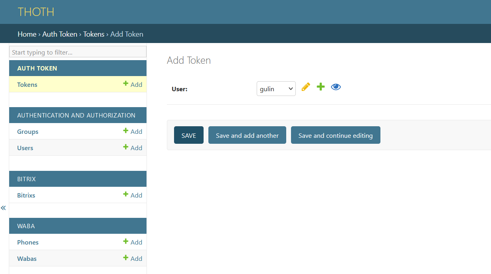
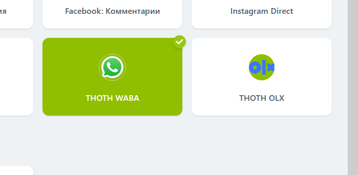

## Подключение портала Битрикс24

Видеоинструкция - https://youtu.be/ti99AeGAr4k

+ В админке создайте токен 



+ В разделе Sites переименуйте example.com в домен по котрому будет доступен thoth
+ Bitrix > Apps - добавить приложение. Заполнить имя (waba, olx) и выбрать домен, установить чекбокс "Connector"
+ После сохранения записи скопировать Id, который отображается в списке приложений.

+ В Битрикс24 создайте серверное локальное приложение без интерфейса (Приложения – Разработчикам – Другое – Локальное приложение) в Битрикс24 и заполните соответствующие поля (Путь вашего обработчика и Путь для первоначальной установки) 
+ Необходимые права (Настройка прав): crm, imopenlines, contact_center, user, messageservice, im, imconnector, disk
```

url установки https://example.com/api/bitrix/?api-key=XXXXXXX&app-id=YYYYYYY
url обработчка https://example.com/api/bitrix/?api-key=XXXXXXX
XXXXXXX - ваш токен
YYYYYYY - id приложения из пред шага
```

+ "Код приложения" (client_id) и "Ключ приложения" (client_secret) копируем в Bitrix > Apps - ваше приложение. Они были выданы Битриксом в предыдущем шаге при установке локального приложения


+ В битриксе в разделе "контакт-центр" должны появиться коннекторы "THOTH WABA" или "THOTH OLX"


