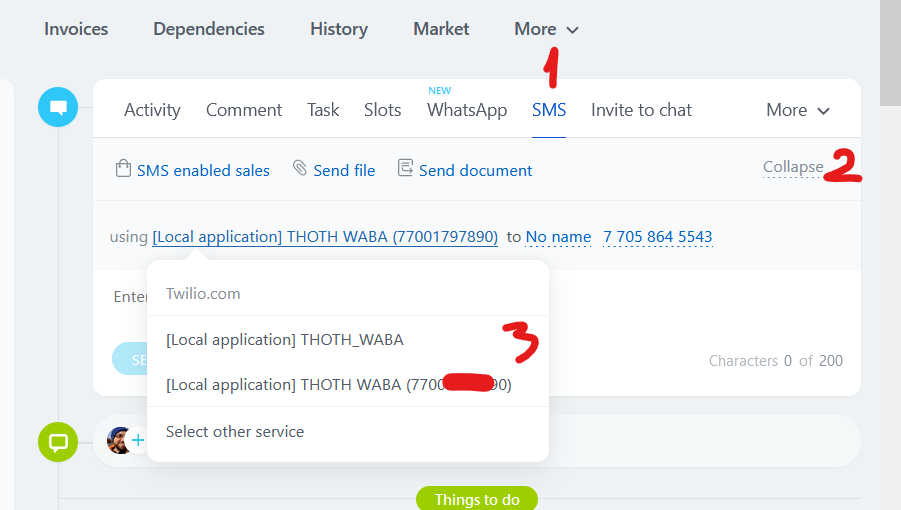
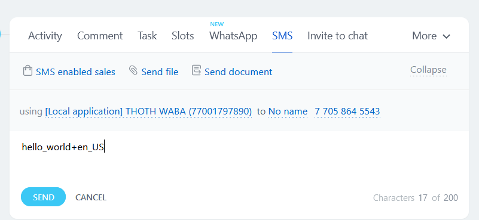
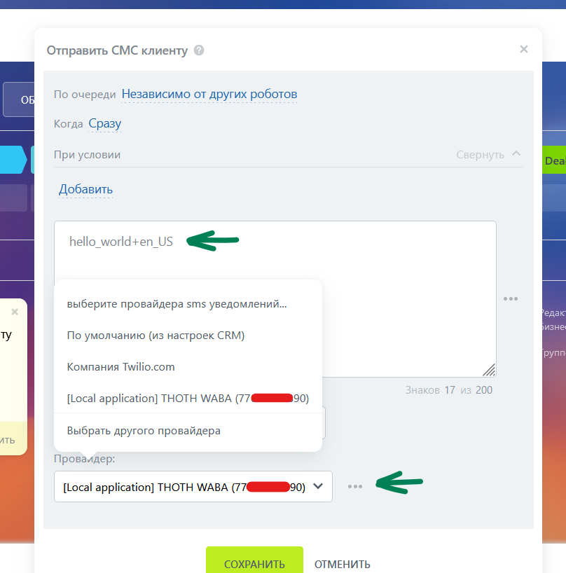

### Служба SMS сообщений
https://dev.1c-bitrix.ru/rest_help/messageservice/index.php

Данная служба Битрикс24 используется в THOTH для отправки уведомлений и сообщений через мессенджеры (напрмиер )

Для отправки [шаблона WABA](https://developers.facebook.com/docs/whatsapp/business-management-api/message-templates?locale=ru_RU) из интерфейса SMS сообщений выберите нужный номер (номера в СМС провадеры автоматически добавляются при подключении нового номера WABA) и введите конструкцию типа "hello_world+en_US", где hello_world - название шаблона WABA, en_US - язык шаблона

### Отправка уведомлений через робота
+ Выберите робота "Отправить смс клиенту"
+ в списке провайдеров выберите нужный номер THOTH WABA
+ в тексте сообщения пишите имя шаблона и язык шаблона hello_world+en_US

