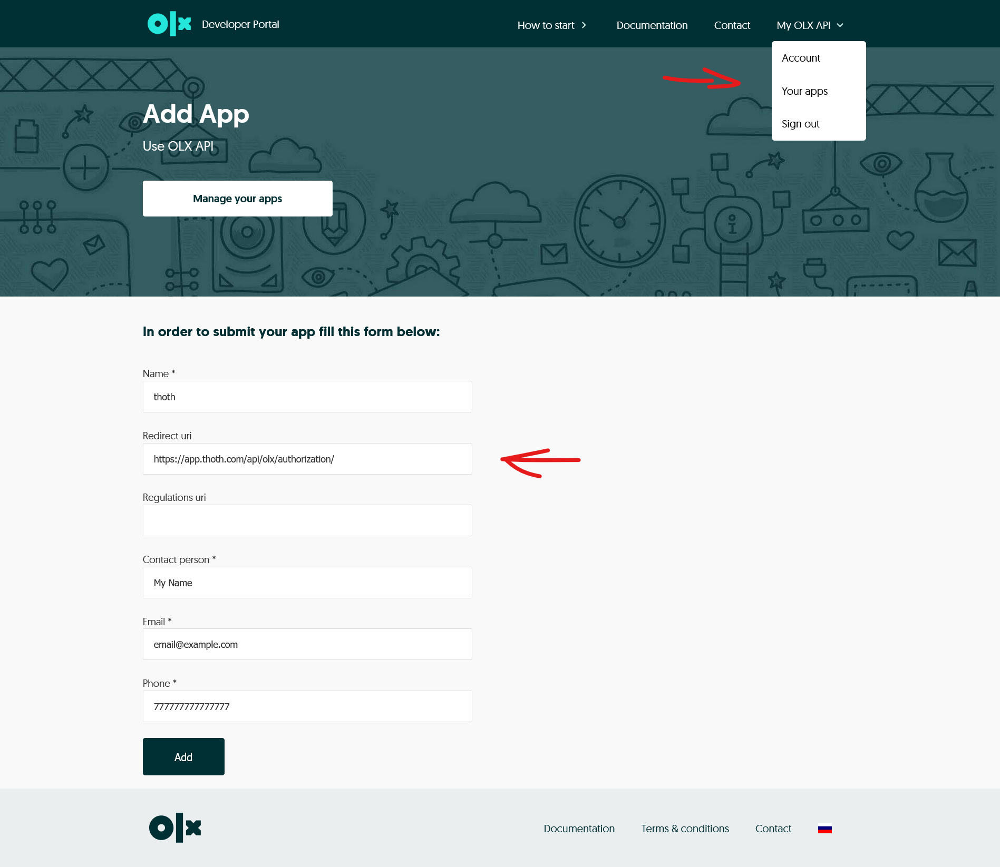
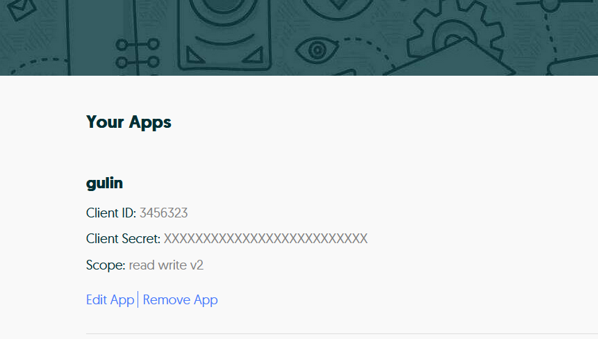
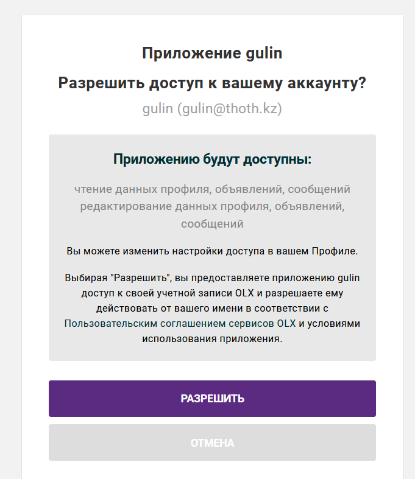
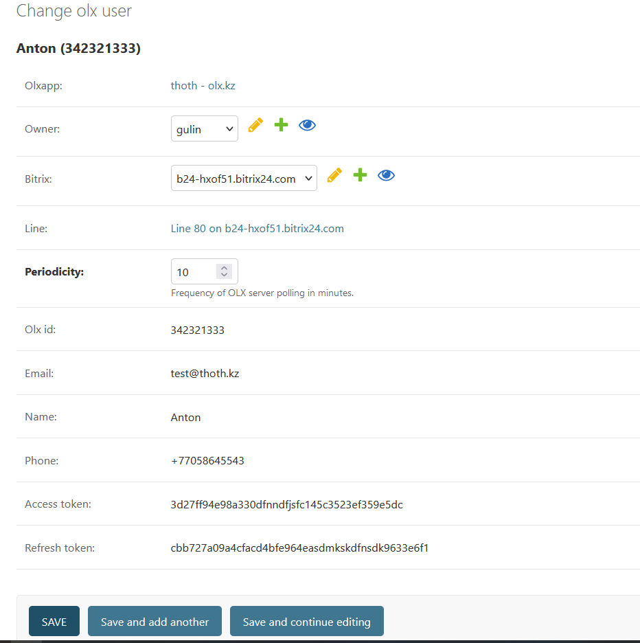

## Установка локального приложения
+ После [установки локального приложения](./bitrix.md) на вашем портале Битрикс24 в разделе Интеграции > Контакт Центр должен появиться коннектор THOTH OLX.

## Настройка системы 
Информацию о сообщениях OLX можно получить только периодическим исходящим запросом, для чего необходим планировщик задач. В thoth используется [celery](https://github.com/celery/celery).  

+ Для обеспечения работоспособности планировщика THOTH на сервере необходимо установить Redis 
+ Примеры для автоматического запуска очереди задач celery [здесь](./example/)
+ Mem. для ручного запуска в win использовать "celery -A config.celery_app worker -l info --pool=solo"
## Создание приложения 
+ Зарегистрируйтесь как разработчик на портале https://developer.olxgroup.com/register?market=olx
+ My OLX > Apps > заполнить поля. 
+ + Поле 'Redirect uri' - https://example.com/api/olx/authorization/

+ Дождитесь подтверждения регистрации приложения. После чего вам будут доступны Client ID и Client Secret

+ В админке thoth > OLX App > Add OLX App и заполнить поля. Client domain, Client id, Client secret - соответствуют вашему приложению на портале OLX

+ После сохранения записи будет сформирована ссылка "Authorization link", которую необходимо использовать для авторизации аккаунтов OLX которые планируется связать с Битркис24. 
+ При переходе по Authorization link на портале OLX будет запрошено подтверждение доступа приложения к аккаунту. Нажимаем "Разрешить"

+ После этого в админке thoth в разделе OLX users появится запись с данными авторизованного пользователя.
+ Откройте учетку выберите системного пользователя, портал Битрикс24 и Periodicity (периодичность проверки наличия новых сообщений. Мин. 10 минут)

+ После сохранения изменений в Битрикс24 будет создана новая Открытая линия, связанная с пользователем OLX.
