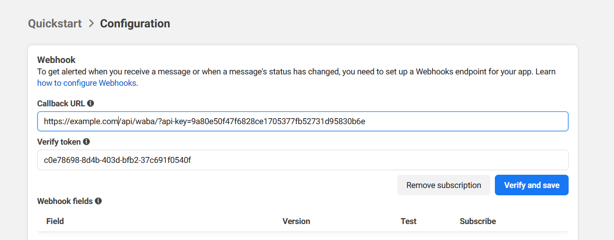
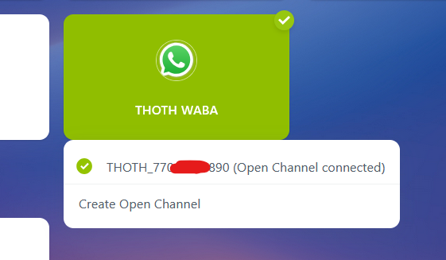

## Подключение WhatsApp (WABA)

Видеоинструкция https://youtu.be/cSirpfq5rPQ
+ Рекомендуется получить [Постоянный маркер](https://developers.facebook.com/docs/whatsapp/business-management-api/get-started), иначе придется перевыпускать токен каждый день
+ Создайте приложение на [портале разработчиков](https://developers.facebook.com/apps/)
+ В панели подключите продукты Webhooks, WhatsApp
+ В админке THOTH - WABA - Add waba 
+ + name - имя вашего приложения 
+ + Access token - Постоянный или временный маркер
+ + После сохранения в списке WABA скопируйте Verify token для нужной учётки

+ На портале разработчиков - Quickstart > Configuration > 
+ + Callback URL - https://example.com/api/waba/?api-key=XXXXXXX
+ + Verify token - Verify token из предыдущего шага 

+ В админке thoth - waba - phones и добавляем номера (Phone - номер, Phone id - id из приложения фейсбук)
+ Выбрать объект waba, созданный ранее
+ Выбрать App instance (портал битрикс) к котрому привязать номер waba
+ Отметьте Чекбокс "Sms service", если хотите зарегистрировать этот номер в качестве [СМС провайдера](messageservice.md)  
+ если все пройдет успешно, то в контакт центре коннектор станет зеленым и кнему будет прикрпелена линия THOTH_ваш_номер

## Особенности работы WABA

+ Самое главное - первыми раз в сутки вы можете писать только используя заранее одобренный шаблон. Если линия (чат) уже создан можете отправить шаблон, используя конструкцию template-hello_world+en_US, где hello_world - назвение шаблона, en_US - язык шаблона. Так же можно отправить первое за сутки шаблонное сообщение через [SMS](messageservice.md)
